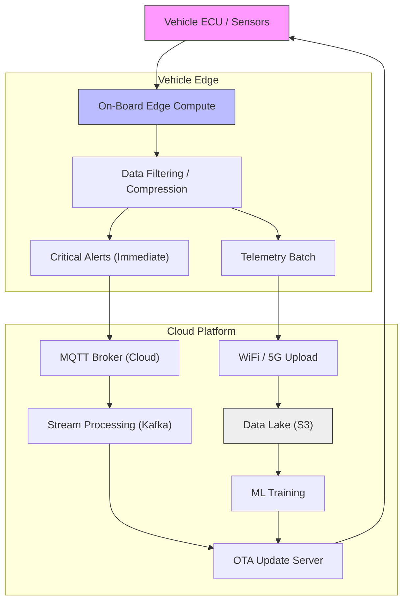

{/* Script: Automotive: Software Defined Vehicles */}

# Automotive: Software Defined Vehicles

## Reference Architecture: The Data Engine

The modern car generates 25GB of data per hour. The challenge is moving it to the cloud without bankrupting the company on 4G costs.

## The Culture War: Mechanical vs Software
The fundamental friction in automotive is not technical; it's cultural.
-   **Hardware Culture (The Default):** "We bend metal. Once the die is cast, making a change costs $50M. Plan everything for 5 years." (Waterfall).
-   **Software Culture (The Invader):** "Code is fluid. Deploy every day. Fail fast." (Agile).
**Result:** When you force Agile on a Hardware culture, you get "Water-Scrum-Fall"—2 week sprints that result in zero releasable code for 3 years.

## The Protocol War: CAN vs Ethernet
Your architecture is defined by how bits move.
-   **Legacy (CAN Bus):** Reliable, but slow (1 Mbps). It's a broadcast network—everyone shouts, everyone listens. Great for brakes; impossible for 4K video.
-   **Modern (Automotive Ethernet / SOME/IP):** Service Oriented. You don't "shout"; you "subscribe".
    -   **Rationality:** You cannot build an SDV on CAN. If your architecture is primarily CAN-based, you are building a "Smart Feature Phone", not a Smartphone.

## The Vendor Trap: Gray Box vs Black Box
-   **Black Box (Traditional):** You buy an ESP (Electronic Stability Program) from Bosch. It saves lives. You cannot read the code. You cannot patch the code. If it bugs out, you file a ticket and wait 6 months.
-   **Gray Box (Modern Partnership):** You co-develop. You own the IP for the "Secret Sauce" (e.g., Regenerative Braking feel), while the vendor supplies the commodity drivers.
-   **In-House (Tesla/BYD):** You write everything.
    -   *Rationality:* Do not attempt In-House unless you have $10B in cash. The validation costs alone will bankrupt you.

## Regulatory Reality: ISO 26262 & ASIL
Software Engineers love "Move Fast and Break Things."
ISO 26262 says: **"If you break things, you go to jail."**

### ASIL Ratings (The "Panic" Metric)
-   **QM (Quality Managed):** The radio. If it crashes, user is annoyed. -> *Agile is fine.*
-   **ASIL-B:** The Dashboard. If it freezes, user is confused. -> *Rigorous Testing.*
-   **ASIL-D:** The Brakes. If it fails, user dies. -> *Formal Methods. Zero Trust.*

> [!CAUTION]
> **The Integration Lie:** Vendors will sell you "ASIL-D Certified Linux". There is no such thing. The *process* is certified, not the binary. You still own the liability.

## Execution Evidence

<ComparisonTable
  headers={["Layer", "Time to Deploy", "Constraint"]}
  rows={[
    ["Infotainment (Mobile OS)", "Weekly", "Search Giants Certification (GAS)"],
    ["Gateway / BCM", "Monthly", "Power Consumption (Dark Current / Battery Drain)"],
    ["Safety (ADAS)", "Yearly", "Homologation (Govt Approval)"],
  ]}
/>

## Decision Matrix: The Zone Architecture
Moving from 100 ECUs to 3 Zone Controllers.

<DecisionMatrix
  data={[
    { factor: "Wiring Weight", rating: "High", reality: "Copper is heavy. Zone architecture reduces cabling by 50%." },
    { factor: "Latency", rating: "Critical", reality: "Ethernet switches introduce non-deterministic latency. Safety systems need Time Sensitive Networking (TSN)." },
    { factor: "Vendor Grip", rating: "Extreme", reality: "Suppliers hate Zone Architecture because it commoditizes their hardware into 'dumb nodes'." },
  ]}
/>

## Interactive Analysis: The "Make vs Buy" for OS

<InteractiveDecisionTree
  steps={[
    {
      id: "root",
      question: "Do you have 2,000 OS Engineers?",
      options: [
        { label: "Yes (Mercedes/VW)", nextStep: "kernel" },
        { label: "No (Most OEMs)", outcome: "android" },
      ]
    },
    {
      id: "kernel",
      question: "Are you forking Linux?",
      options: [
        { label: "Yes, Yocto build.", outcome: "custom" },
        { label: "No, QNX / VxWorks.", outcome: "rtos" },
      ]
    }
  ]}
  outcomes={[
    {
      id: "android",
      title: "Mobile OS Automotive (GAS)",
      type: "warning",
      recommendation: "Accept your fate. You are a hardware shell for Search Giants Maps. But your UX will be silky smooth.",
      risks: ["Loss of User Data", "Search Giants Tax"],
      mitigation: ["Build a killer Companion App", "Focus on Cabin Luxury"]
    },
    {
      id: "custom",
      title: "Custom Linux Distro",
      type: "danger",
      recommendation: "VW Cariad tried this. It cost billions and delayed the Porsche Macan by 2 years. Proceed with extreme caution.",
      risks: ["Maintenance Hell", "Security Vulnerabilities"],
      mitigation: ["RedHat In-Vehicle OS", "Heavy Partner reliance"]
    },
    {
      id: "rtos",
      title: "Commercial RTOS (QNX)",
      type: "success",
      recommendation: "The industry standard for safety/reliability. Not free, but nobody ever got fired for picking QNX for the safety cluster.",
      risks: ["Licensing Costs", "Developer Experience (Not Linux)"],
      mitigation: ["Hypervisor to run Linux alongside QNX"]
    }
  ]}
/>
