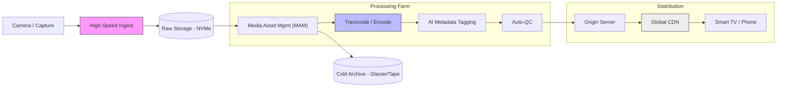

{/* Script: Media: Content Supply Chain */}

# Media: Content Supply Chain

## Reference Architecture: The Digital Factory

Media is no longer about tapes; it's a global software supply chain moving petabytes of data.

## How to Improve Your Architecture

### 1. Hybrid Cloud for Rendering
-   **Problem:** 4K/8K rendering requires massive compute bursts.
-   **Solution:** Keep steady-state workloads on-prem (cheaper for massive data), but burst to Cloud Provider/Cloud Provider Spot Instances for peak rendering jobs.

### 2. AI-Driven Metadata (The Search Fix)
Editors spend 30% of their time searching for "that shot of the blue car".
-   **Implement:** AI Vision models (like Search Giants Video Intelligence) to automatically tag every frame.
-   **Benefit:** "Show me all shots of `<Actor>` smiling" returns instant results.

### 3. Edge Delivery (CDN Optimization)
-   **Latency Kills Engagement:** If start time > 2s, 10% of users drop off.
-   **Architecture:** Use Multi-CDN switching. Real-time client-side measurement (e.g., Conviva) decides which CDN serves the next segment based on current throughput.
---
title: "Media: Content Efficiency vs Tech Debt"
description: "Streaming wars, ad-tech complexity, and the fight for attention."
---

# Media: Content Efficiency vs Tech Debt

## The Reality Check
Media companies are split between "Creative" (Chaos/Art) and "Delivery" (Engineering/Scale). The conflict is usually: Creative wants to launch a new format *tomorrow*, and Engineering says the CMS will take 6 months to support it.

## Why Hybrid Survives Here
- **Content Creation**: Ad-hoc, deadline-driven (The Oscars don't move).
- **Player/Streaming**: High-reliability Engineering (Broadcast grade).
- **Ad-Tech**: High-performance, low-latency (Real-time bidding).

## Regulatory & Data Constraints
- **Rights Management (DRM)**: Territory restrictions are hard logic constants.
- **Privacy (VPPA)**: Video consumption data is highly regulated in some regions.
- **Accessibility**: CVAA compliance for captions/subtitles.

## Vendor Ecosystem Traps
- **OVP (Online Video Platform)**: Brightcove/Kaltura lock-in. Hard to leave once your library is transcoded.
- **Ad Servers**: Search Giants DFP dominance makes independence difficult.

## Execution Evidence

<ComparisonTable
  headers={["Component", "Risk", "Mitigation"]}
  rows={[
    ["CMS", "Becomes a monolith", "Headless CMS architecture"],
    ["Player", "Device fragmentation", "Standardize on HTML5/ExoPlayer wrappers"],
    ["Ads", "User experience degradation", "Server-side Ad Insertion (SSAI)"],
  ]}
/>

## Decision Matrix: CMS Build vs Buy

<DecisionMatrix
  data={[
    { factor: "Editorial Freedom", rating: "High", reality: "Editors hate generic CMS UIs." },
    { factor: "Maintenance", rating: "Medium", reality: "Building a rich text editor is harder than you think." },
    { factor: "Scale", rating: "High", reality: "Breaking news spikes can drown a WordPress instance." },
  ]}
/>

## Interactive Analysis: The Streaming Stack

<InteractiveDecisionTree
  steps={[
    {
      id: "root",
      question: "Is your content Live or VOD?",
      options: [
        { label: "Live Events (Sports/News)", nextStep: "live" },
        { label: "Library VOD", outcome: "vod" },
      ]
    },
    {
      id: "live",
      question: "Can you tolerate >30s latency?",
      options: [
        { label: "Yes, it's just news.", outcome: "hls" },
        { label: "No, sports betting involved.", outcome: "webrtc" },
      ]
    }
  ]}
  outcomes={[
    {
      id: "vod",
      title: "Use Commodity CDN",
      type: "success",
      recommendation: "Static file delivery is solved. Focus on recommendation algorithms, not packet delivery.",
      risks: ["Storage costs"],
      mitigation: ["Tiered storage", "Just-in-time packaging"]
    },
    {
      id: "hls",
      title: "Standard HLS/DASH",
      type: "success",
      recommendation: "Robust, scalable, cheap. Good enough for 90% of live use cases.",
      risks: ["Twitter spoilers (Latency)"],
      mitigation: ["Low-latency HLS tuning"]
    },
    {
      id: "webrtc",
      title: "WebRTC / UDP",
      type: "danger",
      recommendation: "This is cutting edge and expensive. Only build if real-time interaction (betting, chat) is the core product.",
      risks: ["Scale issues", "Cost per user"],
      mitigation: ["P2P offload", "Specialized vendors (Phenix/Red5)"]
    }
  ]}
/>
