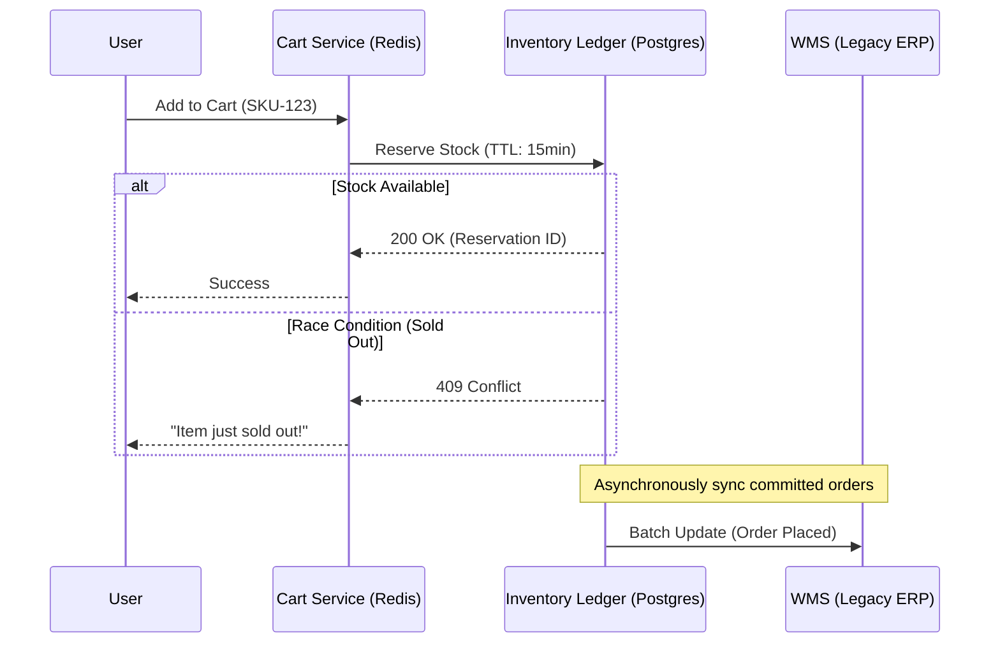

{/* Script: Retail: High Frequency Inventory */}

# Retail: High Frequency Inventory

## Reference Architecture: The Inventory Ledger

Everyone thinks Retail is about "rendering product pages". It's not. Retail is about **Inventory Integrity**.

## The "Oversell" Crisis (ACID vs BASE)

In a flash sale (e.g., PS5 Launch, Yeezy Drop), 50,000 requests hit "Buy" in the same second. 
Reference inventory is 100 units.

### 1. The Pessimistic Lock (Safe but Slow)
`SELECT * FROM stock WHERE sku = '123' FOR UPDATE;`
- **Result:** You lock the row. 49,999 users hang. The database CPU spikes to 100%. Site crashes.
- **Verdict:** Unusable at scale.

### 2. The Optimistic Lock (Fast but Flaky)
`UPDATE stock SET qty = qty - 1 WHERE sku = '123' AND qty > 0;`
- **Result:** fast, but under high concurrency, you generate massive "Retry" storms.
- **Verdict:** Better, but requires heavy client-side retry logic.

### 3. The Redis Reservation (The Standard)
Use Lua script in Redis to decrement atomic counters.
- **Result:** 100k OPS. Extremely fast.
- **Risk:** Redis is "ephemeral". If Redis crashes before syncing to Postgres, you just sold 5,000 phantom units. 
- **Business Decision:** Do you prefer **Lost Sales** (System Down) or **Forgiven Oversells** (Apology Emails)? Most retailers choose the latter.

## Reference Architecture: Headless vs Monolith

<ComparisonTable
  headers={["Architecture", "Velocity", "Risk"]}
  rows={[
    ["Monolith (Shopify/Salesforce)", "High (Initial)", "Vendor Trap. API Rate Limits kill flash sales."],
    ["Headless (Composable)", "Low (Initial)", "Integration Hell. You are now the system integrator for 15 SaaS tools."],
    ["Hybird (The Smart Path)", "Medium", "Keep Checkout on Monolith (Compliance). Move Layout/Search to Headless (Speed)."]
  ]}
/>

## The "Third Party" Circuit Breaker

Modern retail is a mesh of 3rd parties:
-   **Payment:** Stripe / Adyen
-   **Tax:** Avalara / Vertex
-   **Shipping:** Shippo / FedEx API

**The Failure Mode:**
Avalara goes down on Black Friday. Your checkout calls `calculateTax()`. It hangs for 30 seconds. All threads in your Node.js server are blocked waiting. **Your entire site goes down because a tax calculator is slow.**

**The Fix:**
You MUST implement **Circuit Breakers** (e.g., Opossum).
-   If Avalara fails 5 times, **Stop calling it**.
-   Fallback: "Estimated Tax" (Charge 10%, reconcile later) or "Tax Included" (Eat the cost difference).
-   **Never block a transaction for a non-critical calculation.**
