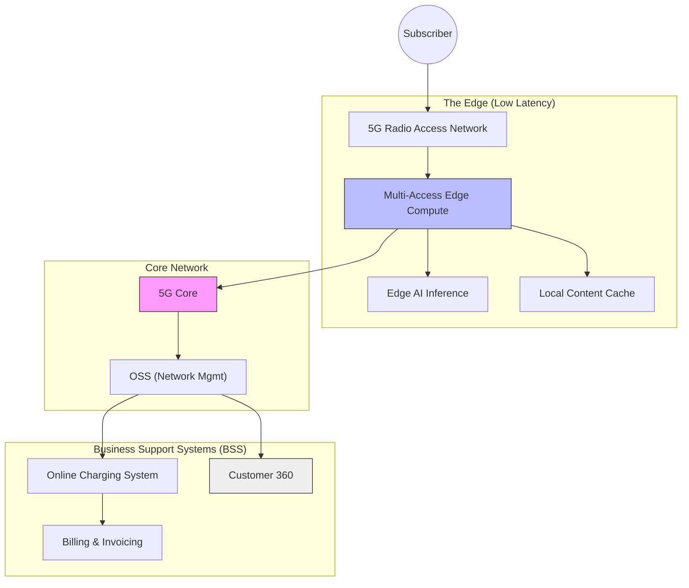

{/* Script: Telecom: The 5G & Edge Frontier */}

# Telecom: The 5G & Edge Frontier

## Reference Architecture: Telco Cloud & Edge

Moving efficiently requires separating the Network Layer (5G/RAN) from the Business Layer (BSS).

## How to Improve Your Architecture

### 1. Decouple OSS and BSS
Traditionally, "Network" (OSS) and "Billing" (BSS) were tightly coupled.
-   **Action:** Implement TMF Open APIs (TM Forum) to standardise communication.
-   **Benefit:** Enables you to swap out a billing vendor without rewriting network probes.

### 2. Move to "Telco Cloud" (CNFs)
-   Stop buying proprietary hardware appliances for network functions.
-   **Virtualization:** Migrate Physical Network Functions (PNFs) to Cloud-native Network Functions (CNFs) running on Kubernetes.
-   **Scale:** Dynamically spin up more 5G Core capacity during Super Bowl/New Year's Eve.

### 3. Edge Compute Monetization
Don't just be a "dumb pipe".
-   **Architecture:** deploy "Local Breakout" at the edge.
-   **Use Case:** Offer low-latency endpoints for Gaming companies or Autonomous Vehicle fleets directly at the cell tower.

## The Reality Check
Telecom is an infrastructure business first, software second. The network (5G/Fiber) involves digging holes in the ground and launching satellites. This capital intensity creates a "Plan-Build-Run" culture that is hostile to "Test-and-Learn".

## Why Hybrid Survives Here
- **Network Engineering**: Waterfall (Physical constraints, huge CAPEX).
- **OSS/BSS**: V-Model (Mission critical, 99.999% uptime).
- **Digital/App**: Agile (Customer facing, churn reduction).

## Regulatory & Data Constraints
- **Lawful Intercept**: Governments must be able to tap lines (CALEA).
- **Critical Infrastructure**: National security implications for downtime.
- **Spectrum Auctions**: Fixed deadlines driven by government licenses.

## Vendor Ecosystem Traps
- **Ericsson/Nokia/Huawei**: You don't buy software; you buy an ecosystem that dictates your roadmap.
- **Standard Bodies (3GPP)**: Innovation is bounded by global interoperability standards, not user stories.

## Execution Evidence

<ComparisonTable
  headers={["Domain", "Velocity", "Constraint"]}
  rows={[
    ["Radio Access Network", "Years (Hardware)", "Physics & Zoning Laws"],
    ["Billing System", "Months (Configuration)", "Revenue Assurance"],
    ["Customer App", "Weeks (Features)", "App Store Review"],
  ]}
/>

## Decision Matrix: OSS/BSS Transformation

<DecisionMatrix
  data={[
    { factor: "Complexity", rating: "Extreme", reality: "Millions of active subscriptions with custom legacy plans." },
    { factor: "Data Migration", rating: "High", reality: "Every migration leaks revenue (billing errors)." },
    { factor: "Vendor Grip", rating: "High", reality: "Proprietary interfaces prevent modularity." },
  ]}
/>

## Interactive Analysis: Build vs Buy OSS?

<InteractiveDecisionTree
  steps={[
    {
      id: "root",
      question: "Do you have 500+ engineers who understand telco protocols?",
      options: [
        { label: "Yes, we are a tech co.", nextStep: "scale" },
        { label: "No, we are a network co.", outcome: "buy" },
      ]
    },
    {
      id: "scale",
      question: "Is your differentiation in the plan structure or the network quality?",
      options: [
        { label: "Plan structure (MVNO)", outcome: "build" },
        { label: "Network quality", outcome: "buy" },
      ]
    }
  ]}
  outcomes={[
    {
      id: "buy",
      title: "Buy COTS (Ericsson/Amdocs)",
      type: "warning",
      recommendation: "Buy the standard stack. Do not customize it. Change your business processes to fit the software.",
      risks: ["Vendor lock-in", "High change request costs"],
      mitigation: ["Strict 'No Customization' policy", "Strong procurement team"]
    },
    {
      id: "build",
      title: "Build Custom Stack",
      type: "success",
      recommendation: "If you are a disruptor (e.g., Jio, Rakuten), building gives you speed that incumbents cannot match.",
      risks: ["Talent acquisition", "Protocol complexity"],
      mitigation: ["Open source telecom stack (Magma)", "Cloud-native architecture"]
    }
  ]}
/>
